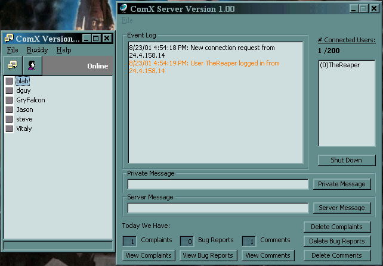



## ICQ Clone

### Description

I took parts of a few source codes I found on this site and combined them and improved them to make a more complete ICQ Clone. The following three pages are where I took code from(that I remember). I made this like 9 to 10 months ago. As you might notice the code has been changed a lot from the originals. I hope this helps people. http://www.planet-source-code.com/xq/ASP/txtCodeId.6520/lngWId.1/qx/vb/scripts/ShowCode.htm http://www.planet-source-code.com/xq/ASP/txtCodeId.2039/lngWId.1/qx/vb/scripts/ShowCode.htm http://www.planet-source-code.com/xq/ASP/txtCodeId.10397/lngWId.1/qx/vb/scripts/ShowCode.htm I've included a text file with code that might assist in improving the communication between the client and server or client to client transfers.
 
### More Info
 

             |
---                |---
**Submitted On**   |2001-08-23 17:12:34
**By**             |[J\. B\.](https://github.com/Planet-Source-Code/PSCIndex/blob/master/ByAuthor/j-b.md)
**Level**          |Beginner
**User Rating**    |5.0 (30 globes from 6 users)
**Compatibility**  |VB 6\.0
**Category**       |[Complete Applications](https://github.com/Planet-Source-Code/PSCIndex/blob/master/ByCategory/complete-applications__1-27.md)
**World**          |[Visual Basic](https://github.com/Planet-Source-Code/PSCIndex/blob/master/ByWorld/visual-basic.md)
**Archive File**   |[ICQ Clone252238232001\.zip](https://github.com/Planet-Source-Code/j-b-icq-clone__1-26587/archive/master.zip)

